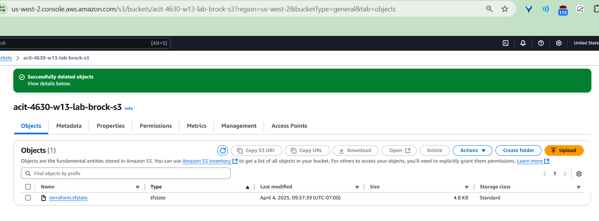
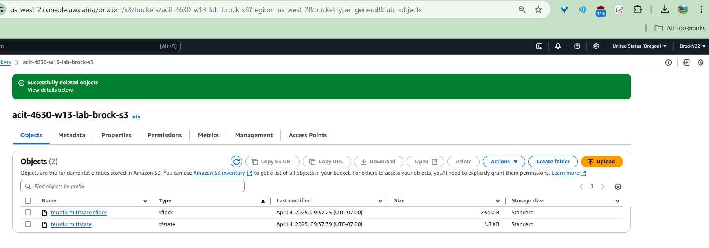

# 4640-w13-lab-start-w25
###### When is the state file created
- The state file is created when you run your first terraform apply command. 

###### When is the lock file present?
- Every single time the Terraform apply command is invoked. 

###### Is the lock file always in the bucket after it is created?
- No it is not. 

